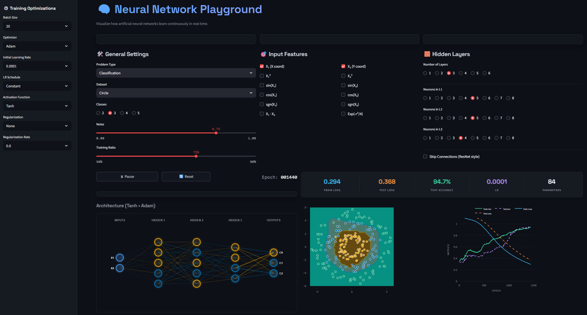

<div align="center">
  
# 🧠 Neural Network Playground

**A Real-Time Neural Network Visualizer built entirely from scratch.**

[](https://python.org)
[](https://numpy.org/)
[](https://streamlit.io/)
[](https://plotly.com/)

</div>

<br>

Welcome to the **Neural Network Playground**, an interactive web application that demystifies how artificial neural networks learn. Instead of relying on high-level frameworks like TensorFlow or PyTorch, this project features a **custom-built Neural Network engine written purely in NumPy**, allowing you to visualize forward propagation, backpropagation, and mathematical optimization in real-time right in your browser.

---

## ✨ Key Features

- ⚙️ **From-Scratch Deep Learning Engine**: A fully vectorized Multilayer Perceptron (MLP) built explicitly with NumPy. Features include:
  - Custom implementations of Forward and Backward propagation.
  - Multiple Optimizers: SGD, Momentum, RMSprop, and Adam.
  - Dynamic Learning Rate Schedulers (Exponential Decay, Cosine Annealing).
  - L1 / L2 Regularization mechanics.
  - Residual (Skip) Connections.
- 🏎️ **Flicker-Free Real-Time Rendering**: Solves Streamlit's native component-flashing by utilizing static React keys and custom UI-revision handling in Plotly, achieving a butter-smooth real-time animation of the decision boundary.
- 🎨 **Premium UI/UX**: A highly polished "Glassmorphism" dark-mode interface designed for Data Scientists.
- 📊 **Unified Metrics Tracking**: Live monitoring of Train/Test Loss and Accuracy curves overlaid on a single, synchronized, auto-projecting axis.
- 📐 **Dynamic SVG Architecture Visualization**: An automatic, mathematically accurate SVG generator that maps network topology, neurons, and precise weighted connections (positive/negative) dynamically as the network trains.

---

## 🛠️ Tech Stack

- **Core Engine**: Python 3.x, `NumPy` (Vectorized Math & Matrix Operations).
- **Frontend Dashboard**: `Streamlit` (Interactive Widgets & Application State Routing).
- **Data Visualization**: `Plotly Graph Objects` (Contour Boundary Maps & Live Metric Curves).
- **Web Styling**: Custom injected CSS3 (Glassmorphism, Google Fonts `Space Grotesk` & `Inter`).

---

## 🚀 Getting Started

### Prerequisites

Ensure you have Python 3.9+ installed. You will need `numpy`, `streamlit`, and `plotly`.

### Installation

1. **Clone the repository:**
   ```bash
   git clone https://github.com/fragompul/neural-network-playground.git
   cd neural-network-playground
   ```

2. **Install the dependencies:**
   ```bash
   pip install -r requirements.txt
   ```

3. **Launch the application:**
   ```bash
   streamlit run app.py
   ```

4. **Open your browser:** Navigate to `http://localhost:8501`.

---

## 🔬 Under The Hood: The Math

This playground doesn't use black-box libraries. Every calculation is exposed:

### Loss Functions
- **Categorical Cross-Entropy (CCE) + Softmax**: For robust multi-class classification (2 to 5 classes).
- **Mean Squared Error (MSE), MAE, Huber Loss**: For regression problems predicting continuous spatial distributions.

### Activation Functions
Fully implemented derivatives for the backpropagation chain rule:
- `ReLU`, `LeakyReLU`, `Tanh`, `Sigmoid`, `ELU`, `Swish`, and `Linear`.

### Real-Time Epoch Engine
The application relies on an internal batching loop that yields frame data back to Streamlit using Websockets, avoiding heavy DOM re-rendering. This allows the app to train the mathematical model and render the complex Plotly contour boundaries simultaneously without blocking the main browser thread.

---

## 📸 Screenshots / Demo



---

## 🧠 What Can You Learn From This?

1. **Feature Engineering**: Understand how polynomial features ($X^2$) or Trigonometric features ($sin(X)$) warp the spatial mapping of a linear perceptron to solve non-linear datasets (like the XOR or Spiral problem).
2. **Overfitting & Regularization**: Crank up the layers and watch the model memorize noise. Then, apply L2 Regularization and watch the decision boundary smooth out in real-time.
3. **Vanishing Gradients**: Test deep networks with `Sigmoid` vs `ReLU` to visually witness the gradient death problem on the deeper hidden layers.

---

## 📄 License

This project is open-source and available under the [MIT License](LICENSE).

<br>

<div align="center">
  <i>Built with passion by a Machine Learning enthusiast. Perfect for understanding the deep mathematical roots of AI.</i>
</div>

---

## Author

**Francisco Javier Gómez Pulido**

*Machine Learning Engineer @ IMSE-cnm (CSIC) | Double Major in Mathematics & Computer Science* | Master's in Artificial Intelligence

📫 **Let's connect:**
* **LinkedIn:** [linkedin.com/in/frangomezpulido](https://www.linkedin.com/in/frangomezpulido)
* **GitHub:** [github.com/fragompul](https://github.com/fragompul)
* **Email:** [frangomezpulido2002@gmail.com](mailto:frangomezpulido2002@gmail.com)

---
*If you find this repository interesting or useful for your research, feel free to ⭐ star it!*
